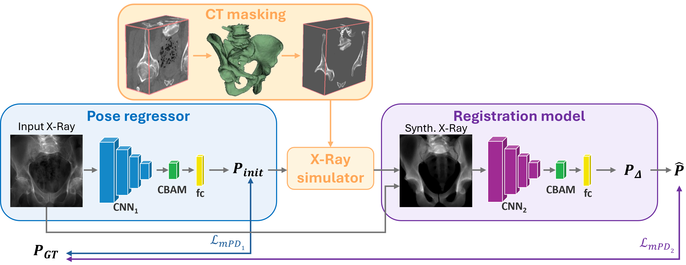

# LXPose++: an Attention-Based Framework for Robust Real-Rime CT to X-Ray Registration

---

- [Overview](#overview)
- [Content](#content)
- [Contact](#contact)
- [Pretrained Weights](#pretrainedweights)

## Overview

Minimally invasive interventions rely on live 2D X-ray imaging for guidance, but X-rays lack
depth and soft-tissue contrast, forcing clinicians to mentally register them with preoperative
3D Computed Tomography (CT) volumes. Our previous work, LXPose, addressed this with a
real-time, self-supervised multi-stage CNN that estimates the C-arm pose in a single forward
pass, removing the need for slow iterative optimization. However, its accuracy remained limited
by the domain gap between synthetic training DRRs and real intraoperative X-rays.

LXPose++ extends this framework with two targeted, complementary strategies to close that gap:

- **Anatomical CT masking**: the CT volume is masked to retain only rigid bony structures before
  DRR rendering, preventing the network from chasing anatomy that deforms intraoperatively
  (e.g. soft tissue).
- **CBAM attention**: a Convolutional Block Attention Module is integrated into both CNN stages,
  applying channel-wise and spatial attention to steer the network toward the most informative
  image regions.

On two public datasets spanning different anatomies (DeepFluoro and Ljubljana), these additions
nearly halve the projection error of the base LXPose with no added inference cost, reaching
accuracy competitive with offline optimization-based methods that are two orders of magnitude
slower, while remaining within the 40 ms real-time control budget.

## Content

- `train_cascade_deepfluoro.py` / `train_ljubljana.py` : train the two-stage CNN for registration
  of 3D preoperative CTs to 2D intraoperative X-rays, on DeepFluoro and Ljubljana respectively
- `models.py` : pose regressor and registration models (ResNet-18 backbone + CBAM + fc layers)
- `test_deepfluoro.py` / `test_ljubljana.py` : evaluate trained models on real X-ray test sets
- `hip_landmark_extraction.py` : extract bone landmarks from DeepFluoro CT volumes via Farthest
  Point Sampling on a Marching Cubes mesh, for use as supervision targets (mPD loss)
- `vessel_landmark_extraction.py` : extract vascular landmarks from Ljubljana 3D DSA
  volumes for use as supervision targets
- `utils.py` : shared utilities (homography)

## Pretrained Weights

Pretrained model weights for both datasets are hosted on [Hugging Face](https://huggingface.co/fedefacente/LXPosepp).

## Contact

For questions or issues, contact <federica.facente@inria.fr>
